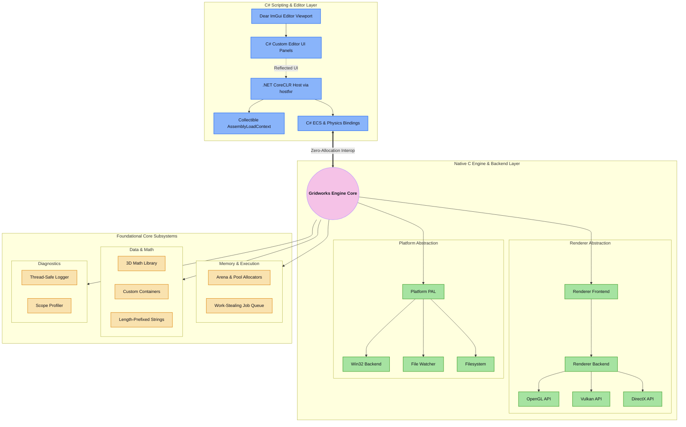

# Gridworks Engine and Editor

Gridworks is a native, high-performance, general-purpose 3D game engine built from the ground up in **C**. It features a robust platform abstraction layer, a modern Vulkan 1.4+ rendering backend (Forward+ / Clustered Forward shading), custom memory management (Arenas & Pools), a thread-safe logger, a custom 3D math library, and a work-stealing job system. 
Crucially, Gridworks integrates a **.NET CoreCLR host** that enables developers to write their game logic and custom editor interfaces in **C#** with high-performance, zero-allocation native interop and **active runtime hot-reloading**.

## 🚀 Key Architectural Pillars
*   **Native C Core**: Uncompromising control over memory allocations, thread safety, rendering pipelines, and CPU execution.
*   **Renderers**: 
    *   **Vulkan 1.4+** High-performance Clustered Forward shading engine utilizing double-buffered frames, compiled SPIR-V pipelines, and dynamic device/swapchain handling.
    *   **DirectX 12** High-efficiency, low-overhead modern renderer for Windows platforms, utilizing command queues, pipeline state objects (PSOs), and explicit resource barriers for close-to-metal control. (Future Support)
    *   **OpenGL 4.6** Legacy Support - Reliable cross-platform fallback rendering pipeline using state-machine architecture and modern AZDO (Approaching Zero Driver Overhead) techniques to maintain compatibility with older hardware. (Future Support)
*   **Zero-Allocation C# Interop**: Type-safe C# generics mapping directly to C's Sparse-Set ECS via memory pointer exchange, preventing Garbage Collection (GC) pauses during the game loop.
*   **Sparse-Set ECS**: Cache-friendly entity-component system in native C, exposed to C# via zero-allocation pointer exchange without triggering GC.
*   **Collectible AssemblyLoadContext Hot Reloading**: Edit C# game script classes and custom inspector panels in your IDE, rebuild the C# projects, and watch the running engine hot-reload the assemblies instantly without halting execution.
*   **Visual Viewport Editor**: Integrated Dear ImGui (cimgui) viewport for scene inspection, entity hierarchy, and custom C# editor panels.


## 📐 Architecture Overview


## 📁 Directory Structure
```text
Gridworks/
├── assets/                    # Development assets (textures, shaders, models)
│   └── shaders/
│       ├── mesh.vert          # GLSL vertex shader
│       └── mesh.frag          # GLSL fragment shader
├── build/                     # Native & managed compilation outputs
├── managed_src/               # Managed C# codebase
│   ├── Gridworks.sln          # Solution file combining managed projects
│   ├── Gridworks.Engine/      # C# Engine API, ECS bindings, math, and P/Invoke layers
│   ├── Gridworks.Editor/      # C# Editor custom UI panel interfaces
│   └── UserProject/           # Developer game project containing scripts & custom panels
├── src/                       # Native C codebase
│   ├── core/                  # Arenas, math, logger, job queue, strings, and .NET host
│   ├── platform/              # Window, input, timing, file watcher (Win32)
│   ├── renderer/              # Dynamic Vulkan loader, swapchain, pipeline compilation
│   ├── physics/               # Rigid-body integrator, colliders, impulse solver
│   ├── ecs/                   # Sparse-set entity component system
│   ├── audio/                 # Audio mixer (miniaudio integration)
│   ├── editor/                # cimgui wrapper and default viewport GUI
│   └── main.c                 # Native bootstrap & main game loop entry point
├── Makefile                   # Build script orchestrating C and .NET compilations
└── LICENSE                    # Apache License 2.0
```

---
## 🛠️ Getting Started
### Prerequisites
To compile and run Gridworks, ensure your development environment has:
1.  **Vulkan SDK 1.4+**: Ensure `glslc` is in your system PATH for shader compilation.
2.  **.NET 8.0 SDK (or later)**: For building the managed scripting assemblies.
3.  **C Compiler & GNU Make**: GCC/Clang or MSVC configured under a shell environment with GNU Make.
4.  **Windows OS**: The initial platform abstraction layer targets Win32.
### Building the Engine
Gridworks uses a root-level Makefile to build both the C engine and the C# assemblies:
```bash
# Compile both the C executable and the C# assemblies
make -f makefile.windows.mak
```
Or build components individually:
```bash
# Build the native C executable only
make native
# Build the C# projects using dotnet CLI
dotnet build managed_src/Gridworks.sln
```
### Running Gridworks
Start the compiled engine binary:
```bash
.\build\gridworks.exe
```

---
## 💻 Scripting in C#
### Creating an Entity Script
User scripts inherit from `EntityScript` and allow direct manipulation of entities and components.
```csharp
using Gridworks.Engine;
public class PlayerController : EntityScript
{
    private ref Transform transform;
    private ref RigidBody rigidBody;
    public override void OnStart()
    {
        // Get zero-allocation references to native C ECS components
        transform = ref GetComponent<Transform>();
        rigidBody = ref GetComponent<RigidBody>();
    }
    public override void OnUpdate(float deltaTime)
    {
        // Simple WASD movement mapping directly to rigid body impulses
        Vector3 force = Vector3.Zero;
        if (Input.GetKey(Keys.W)) force.Z -= 10f;
        if (Input.GetKey(Keys.S)) force.Z += 10f;
        if (Input.GetKey(Keys.A)) force.X -= 10f;
        if (Input.GetKey(Keys.D)) force.X += 10f;
        rigidBody.ApplyForce(force);
    }
}
```
### Scripting Custom Editor Panels
Add custom UI panels to the Dear ImGui editor viewport using the `[EditorCustomization]` attribute:
```csharp
using Gridworks.Engine;
using Gridworks.Editor;
[EditorCustomization]
public class CustomInspector : EditorPanel
{
    private string title = "Game Config";
    private float gravity = -9.81f;
    public override void OnDrawUI()
    {
        ImGui.Begin(title);
        
        ImGui.Text("Adjust Engine Settings:");
        if (ImGui.SliderFloat("Gravity Y", ref gravity, -20f, 0f))
        {
            // Update native physics settings directly
            PhysicsWorld.SetGravityY(gravity);
        }
        ImGui.End();
    }
}
```
---
## 🔄 Dynamic Hot Reloading
> **Note:** Hot-reloading currently relies on `ReadDirectoryChangesW` and is Windows-only.
Gridworks utilizes a Windows background thread via `ReadDirectoryChangesW` to monitor recompilations of `UserProject.dll`.
When `UserProject.csproj` is compiled:
1.  The file watcher flags the modification.
2.  The engine pauses game ticks.
3.  The .NET Host triggers `Gridworks.Engine.dll` to unload `UserProject.dll` via the collectible `AssemblyLoadContext`.
4.  Garbage Collection is explicitly invoked (`GC.Collect()` & `GC.WaitForPendingFinalizers()`) to reclaim memory and release the assembly handles.
5.  The host loads the fresh `UserProject.dll`.
6.  The engine binds new custom panels and script behaviors, then resumes ticks.
This allows real-time code updates (e.g. changing variables, adding logic, modifying inspector views) without needing to close or rebuild the game engine.
---
## 📄 License
[](LICENSE)

Gridworks is open-source software licensed under the [Apache License 2.0](LICENSE).